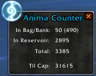
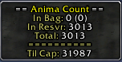

# Anima Counter
'Anima Counter' is a World of Warcraft addon designed to keep track of all Anima in bag/bank and tally them, also how many in reservoir then subtract how much you got left before it's max out.

## Contribute
Please report bugs on the [Github Issue Reporting] https://github.com/vandiel01/AnimaCounter/issues/new.

The use of [BugGrabber] https://www.curseforge.com/wow/addons/bug-grabber and [BugSack] https://www.curseforge.com/wow/addons/bugsack will help tremendously with the debugging process.

You can also contribute to the addon by [Donate] https://paypal.me/Vandiel01

## Image Samples
###### 2nd Version
 
###### 1st Version
 
